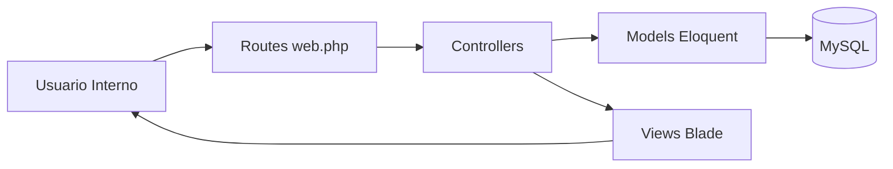

# Arquitectura del Sistema

## Vista general

Arquitectura monolítica MVC basada en Laravel:

1. **Presentación**: Blade + Bootstrap (vistas y navegación)
2. **Aplicación**: Controladores con reglas de negocio
3. **Dominio/Datos**: Modelos Eloquent + MySQL

## Componentes principales

- `Auth\LoginController`: autenticación y redirección por rol
- `EmpleadoController`: HU-08 usuarios
- `ProductoController`: HU-14/HU-13
- `InventarioController`: HU-19
- `PedidoController`: HU-02
- `VentaController`: HU-03/HU-17
- `DashboardController`: panel y alertas

## Diagrama simplificado (Mermaid)

## Seguridad

- Middleware `auth` para módulos internos
- Middleware `role` para control por perfil
- Hash de contraseñas con `Hash::make`
- CSRF en formularios Blade

