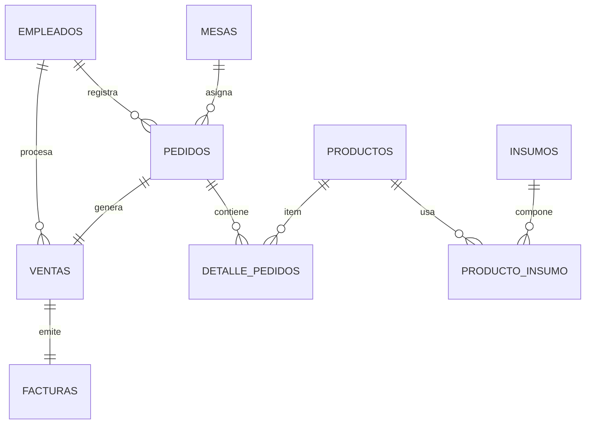

# Modelo de Datos (resumen)

## Entidades principales

- `empleados`
- `productos`
- `insumos`
- `producto_insumo` (N:N con `cantidad_necesaria`)
- `mesas`
- `pedidos`
- `detalle_pedidos`
- `ventas`
- `facturas`

## Relaciones clave

- Empleado 1:N Pedido
- Empleado 1:N Venta
- Mesa 1:N Pedido
- Pedido 1:N DetallePedido
- Producto 1:N DetallePedido
- Producto N:N Insumo (pivot `producto_insumo`)
- Pedido 1:1 Venta
- Venta 1:1 Factura

## Diagrama rápido (Mermaid ER)

